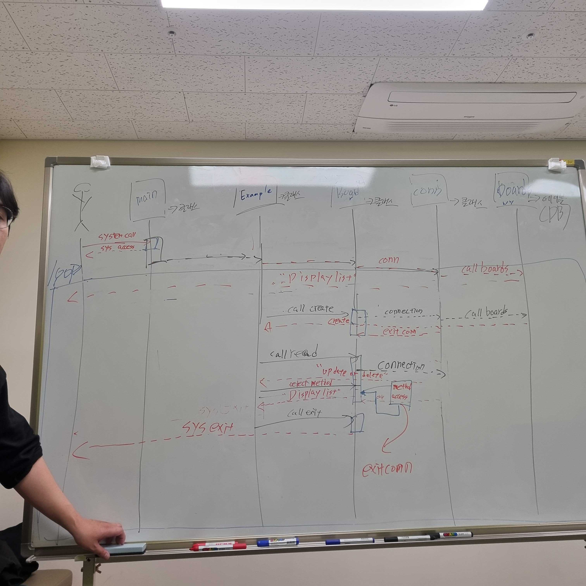
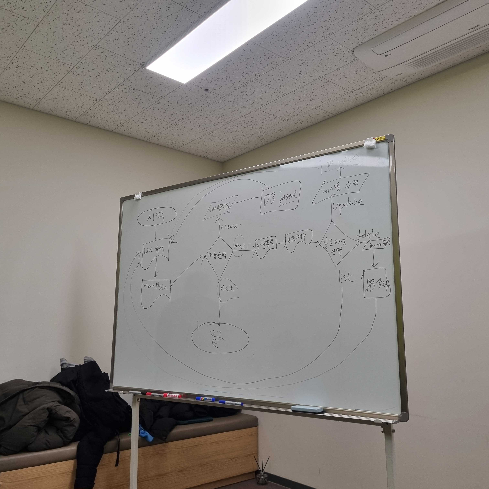
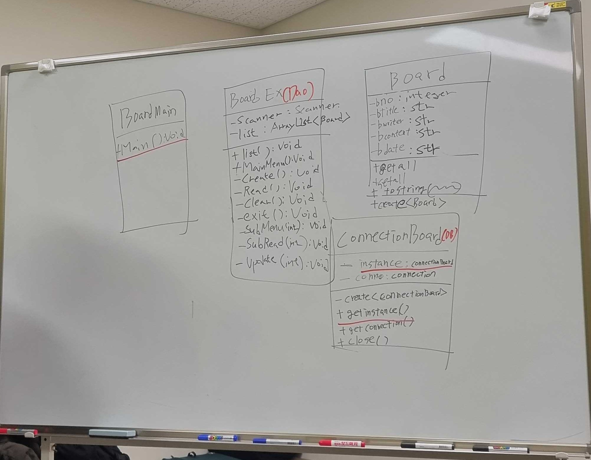
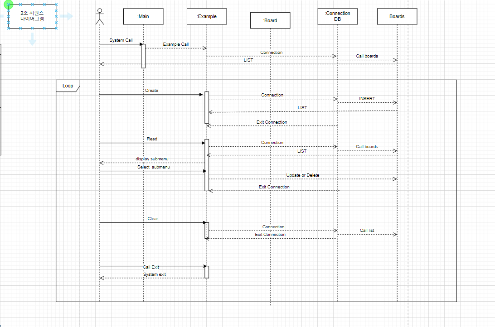
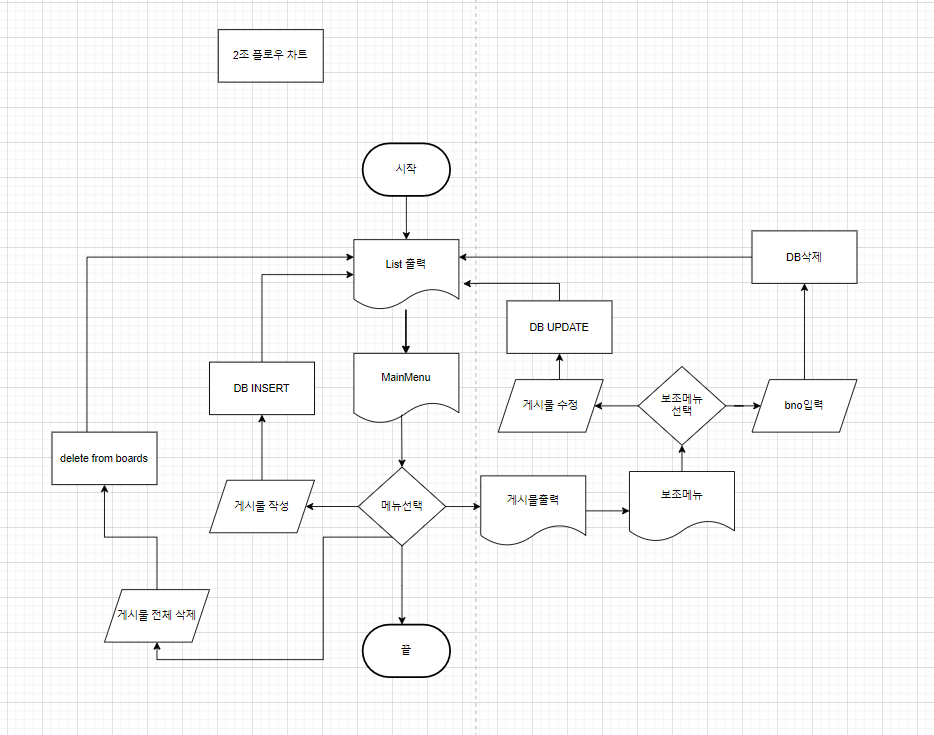
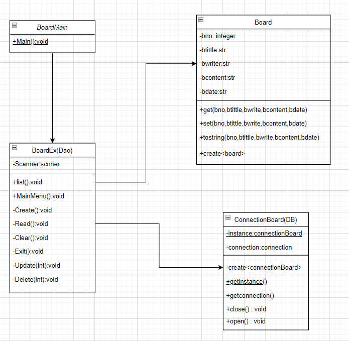

# 첫 회의 

---
1. 진행과정 
2. 요구사항 
3. 프로잭트진행과정 
4. 개인회고 및 피드백

## 진행과정 
1. 시퀀스 다이어그램 작성 
2. 플로우 차트 작성 
3. 클래스 다이어 그램 작성 
4. 코드 작성 

## 요구사항
- JDBC를 사용해서 DB와 연동된 게시판프로그램 작성
- 디테일한 요구사항은 다이어그램을 작성하면서 표현 

## 프로젝트 진행과정 

일단 각자 파트를 나눠서 진행을 하기 보다는 먼저 회의를 통해서 프로젝트를 어떻게 진행할지 
방향성을 잡고 거기에 맞춰서 함께 진행을 하는것으로 이야기를 마쳤다. 
요구사항이 크게 복잡한 부분은 아니였기 때문에 파트를 나눠서 진행을 하진 않았다. 

- 먼저 다이어그램과, 시퀀스를 함께 필사하며 만들었다. 
## 필사로 먼저 공유 

## 다이어그램 작성 

---
## 개인회고(문제해결을 위한 나의 생각과 계획)
- 문제점 
1. **코드구현능력 부족** 

먼저 회의를 진행하기전에 비전공자에다가 부족한 점이 아직 많다고 느껴서 
하루 전 여러 자료들을 참고해서 스스로 구현을 하고자 진행을 했었다. 
여기서 많은 여러움이 있었다. **일단 직접적인 코드 구현을 하는데 있어서 간단한 요구사항이여도 나에겐 아직 그것을 리펙토링하거나 
스스로 변경하는것이 아직 익숙하지 않았고 어디서 오류가 왜 일어나는지 한번에 체크하는것이 쉽지 않았다.**

- 문제를 개선하기 위해 이것은 개인의 역량의 문제라고 생각을 했기에 여러 코드를 리뷰하면서 
자료를 찾아보았다. 그래서 그 코드들이 어떻게 진행이 되었는지 한 줄 한줄 뜯어보면서 주석처리를 하며 스스로 공부를 하는 시간을 가졌다. 

2. **설계단계의 협업의 중요성 파악**
- 미리 코드를 작성을 하고 온 조원이 있었다. 물론 많은 도움이 되었지만 
각자의 생각이 달랐고 직접 만나서 회의를 하다보니 진행방향이 바뀌고 그렇게 다이어그램을 작성을 마치고 코드를 조합해서 만들려고하니 
수정해야하는 부분이 많았다. 그래서 **먼저 설계단계에서의 프로그램을 어떤식으로 진행해야 하는지 파악을 하는것이 굉장히 중요하다는것을 다시 한번 느꼈다.**

---

- 설계과정에서 개발자가 꼭 염두에 두어야 할것 
1. 프로그램을 사용하는 사람이 누구인가? 
2. 프로그램에 대한 요구사항이 무엇인가? 
3. 이 프로그램으로 인해 얻고자 하는 기능이 무엇인가? 
4. 이 프로그램은 언제까지 개발을 마쳐야 하는가? 
5. 어떻게 기능구현들을 할 것인가? 
6. 로직을 어떻게 만드는것이 가장 경제적인가? 

#### 이 부분이 너무나 중요하다는 것을 다시 한 번 느끼게 되었다.

---
## 조원
- 최문석
- 백종훈
- 양성준
- 문지환
- 이다혜
- 이도엽 